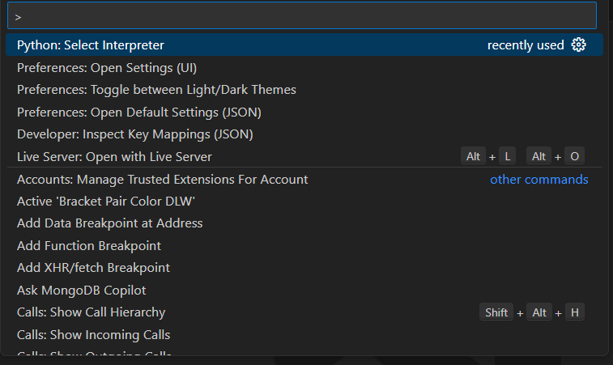
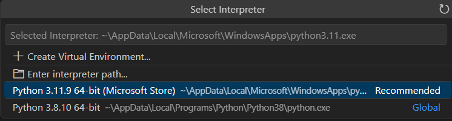

# Pokemon Battle
This project simulates a Pokémon battle, integrating strategic artificial intelligence mechanics to choose moves, switch Pokémon, or use items optimally. Users can directly participate in battles against an AI. The system includes features such as Pokémon healing, move effectiveness calculation based on types and dynamic Pokémon selection, offering an interactive experience that is as faithful as possible to the dynamics of Pokémon games.

## Summary

- [Main Feature](#Main-Feature)
- [Requirements](#Requirements)
- [Installation](#Installation)
- [Usage](#Usage)
- [Project Structure](#Project-Structure)
- [Contributions](#Contributions)
- [Credits](#Credits)
- [License](#License)

## Main Feature

- Battle against an AI

## Requirements

- To run the project correctly, the following system requirements must be met:

- For the Development Environment
  Operating System: Windows, macOS, or Linux
- Python 3.8.11 or higher
- Reccommended text editor: Visual Studio Code (or equivalent)
- Database: MySQL Workbench 8.0
- Required Libraries: Python (for Visual Studio Code)

## Installation

1. Clone the repository:
     git clone https://github.com/CubeTheMaster/Pokemon-Battle.git

2. (if using Visual Studio Code) Select a Python interpreter:
     while not selecting any file press shift+ctrl+P and select the option Python: Select interpreter:
         

     after selecting the option select the reccommended option:
         

3. (if using Visual Studio Code) After selecting the interpreter install the mysql.connector library:
     (inside the Pokemon-Battle directory) pip intall mysql-connector-python

## Usage

1. debug the main.py file

## Project Structure

## Contributions

We warmly welcome contributions to improve this project! Whether you'd like to fix a bug, enhance a feature, or add new functionality, your efforts are greatly appreciated.
Guidelines
Follow the code style and best practices used in the project.
If adding a new feature, ensure it aligns with the project's goals.
Check for existing issues or discussions before creating new ones.
Be respectful and collaborative in your communication.

## Credits

This project, Pokemon Battle, was developed as part of a university assignment for the FIA course at the University of Salerno, Faculty of Computer Science. The project represents the collective efforts of the Pokemon Battle team, aiming to apply artificial intelligence principles to simulate a battle like the ones you can find in the main game line.

## License

This project is open source and available under the MIT License, all credits fall under the Nintendo pokemon company (TM)
